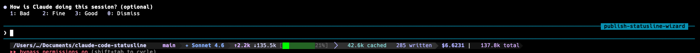

# claude-code-statusline

A Powerlevel10k-style statusline for [Claude Code](https://claude.ai/claude-code) — fully configurable via an interactive wizard.



## Features

- **4 themes**: neon (default), minimal, mono, retro
- **4 separator styles**: round, sharp, slanted, bare
- **3 icon sets**: Nerd Fonts v3, Unicode, ASCII
- **8 configurable segments**: dir, git, model, vim\_mode, tokens, cache, cost, rate\_limits
- **Single `jq` call** for efficient JSON parsing (no subshell per field)
- **p10k-style wizard**: live terminal previews, arrow-key navigation

## Quick Start

```bash
bash <(curl -fsSL https://raw.githubusercontent.com/chandrasekar-r/claude-code-statusline/main/install.sh)
```

Or clone and run manually:

```bash
git clone https://github.com/chandrasekar-r/claude-code-statusline ~/.local/share/claude-statusline
cd ~/.local/share/claude-statusline
./configure
```

The wizard walks you through 5 steps and writes `~/.config/claude-statusline/config.sh`. It can also auto-patch your Claude Code `settings.json`.

## Manual settings.json setup

If you skip the auto-patch, add this to `~/.claude/settings.json`:

```json
{
  "statusCommand": "/path/to/claude-code-statusline/statusline.sh"
}
```

## Reconfigure

```bash
./configure
```

Re-run at any time. Existing config is backed up before overwriting.

## Segments

| Segment | Description | Config prefix |
|---------|-------------|---------------|
| `dir` | Shortened working directory | `CCS_DIR_*` |
| `git` | Branch name + dirty indicator | `CCS_GIT_*` |
| `model` | Claude model + agent name | `CCS_MODEL_*` |
| `vim_mode` | N / I / V mode badge | — |
| `tokens` | ↑ input / ↓ output counts + context bar | `CCS_TOKENS_*` |
| `cache` | Cache read / write counts | `CCS_CACHE_*` |
| `cost` | Session cost ($) + total tokens | `CCS_COST_*` |
| `rate_limits` | 5h / 7d rate limit percentages | `CCS_RATELIMIT_*` |

## Manual configuration

Config lives at `~/.config/claude-statusline/config.sh` (or `$CCS_CONFIG_PATH`):

```bash
CCS_ICON_SET="nerd3"           # nerd3 | unicode | ascii
CCS_SEPARATOR_STYLE="round"    # round | sharp | slanted | bare
CCS_THEME="neon"               # neon | minimal | mono | retro | custom
CCS_SEGMENTS="dir git model tokens cache cost rate_limits"

# Per-segment options
CCS_DIR_MAX_DEPTH=4
CCS_GIT_SHOW_DIRTY=true
CCS_MODEL_SHOW_AGENT=true
CCS_TOKENS_SHOW_BAR=true
CCS_TOKENS_BAR_WIDTH=10
CCS_CACHE_HIDE_IF_ZERO=true
CCS_COST_DECIMAL_PLACES=4
CCS_COST_HIDE_IF_ZERO=true
CCS_RATELIMIT_HIDE_IF_EMPTY=true
```

## Custom theme

Set `CCS_THEME=custom` and override individual background colours:

```bash
CCS_THEME=custom
CCS_COLOR_BG_DIR='\033[48;5;4m'    CCS_COLOR_BG_DIR_RAW=4
CCS_COLOR_BG_MODEL='\033[48;5;17m' CCS_COLOR_BG_MODEL_RAW=17
# ... etc
```

## Adding custom segments

Create `segments/myseg.sh` with a `segment_myseg()` function:

```bash
segment_myseg() {
  # Return 1 to suppress this segment
  [ -z "$some_condition" ] && return 1

  SEGMENT_TEXT=" ${BOLD}${FG_WHITE} my content ${RST}"
  SEGMENT_BG='\033[48;5;5m'
  SEGMENT_FG_NEXT=5        # 256-colour index matching SEGMENT_BG
  return 0
}
```

Then add `myseg` to `CCS_SEGMENTS` in your config.

## Requirements

- bash 4.0+
- jq
- A [Nerd Fonts v3](https://www.nerdfonts.com/) terminal font (for `nerd3` icon set)

## License

MIT
